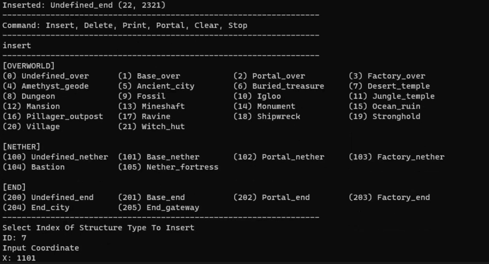

# MCalculator: Coordinate Calculator for Minecraft

| 기능 | 설명 |
| --- | --- |
| TXT파일에서 저장된 좌표 불러오기 | 이전 게임에서 저장했던 좌표를 다시 불러오는 기능 |
| TXT파일에 좌표 덮어쓰기 | 새로 삽입한 좌표를 TXT파일에 추가하는 기능 |
| 분류 카테고리 출력 | 플레이어가 좌표를 적절히 분류할 수 있도록 분류 카테고리를 보여주는 기능 |
| 좌표 삽입 기능 | 좌표를 기록하는 기능 |
| 좌표 삭제 기능 | 잘못 기록되었거나 필요 없어진 좌표를 삭제하는 기능 |
| 좌표 출력 기능 | 저장된 좌표를 정렬하여 출력하는 기능 |
| 좌표 변환 기능 | 오버월드나 네더월드의 좌표를 통해 다른 차원의 좌표를 계산하는 기능 |

### Running screen

# Motivation of Coordinate Logging

> 좌표들을 기준에 따라 분류하여 (X, Z) 형식으로 기록하는 프로그램을 만든다.
> 

마인크래프트의 활동들은 블록으로 이루어진 3D환경에서 진행된다. 3D환경에 맞게 마인크래프트에서는 좌표라는 개념이 있다. 플레이어들은 주변 지형을 기억하지 않아도 지형의 좌표를 이용한다면 원하는 목적지에 도달할 수 있다.

그러나 게임을 할 수록 기억해야 할 좌표의 수는 늘어난다. 따라서 좌표들을 기준에 따라 분류하고 기록해둘 필요가 있다. 좌표를 분류하는 기준은 다음과 같다

- 차원
    
    각 차원은 고유한 특징과 환경을 갖고 있으며, 다른 자원, 몬스터, 생물, 그리고 도전 과제들이 존재한다.  총 세 개의 차원으로 오버월드(Overworld). 네더(Nether), 엔드(End) 가 존재한다. 이 문서에서 Overworld는 0차원, Nether는 1차원, End는 2차원으로 표시한다.
    
- 구조물
    
    각 차원마다 생성되는 구조물들이 있다. 예를 들어 오버월드에서는 동굴이나 마을, 유적지 등이 생성된다. 네더에서는 요새, 무너진 포탈 등이 생성된다. 엔드에서는 도시나 게이트가 생성된다.
    

좌표는 (X, Y, Z) 형식이지만 실제로 플레이어들이 이용하는 좌표는 (X, Z)이다. Coordinate Logging의 목표는 좌표들을 기준에 따라 분류하여 (X, Z) 형식으로 기록하는 프로그램을 만드는 것이다. 

# Design Class

### 추상화

각 차원의 속성들을 그림으로 나타내면 아래와 같다. 

각 차원에는 구조물이 있고 사용자가 입력한 좌표가 기록된다. (structure type, coordinate). 차원들은 좌표들을 컨테이너에 자유롭게 저장 및 삭제를 한다. (InsertCoordinates(), DeleteCoordiantes()). 그리고 이를 출력한다. (PrintNode())

좌표 출력 시 차원을 명시하기 위해서 출력 형태는 차원마다 다르게 설정한다. (PrintNode()) 또한 Overworld와 Nether에는 특정한 관계가 있으므로 End와 독립된 기능을 추가한다.  (Portal())

### **상속 및 다형성**

차원 간의 공통적인 속성을 추출하여 추상 클래스를 만든다.

Dimension은 Overworld, Nether와 End의 부모클래스가 되고 자식 클래스의 공통된 속성을 정의한다. 자식 클래스에는 다른 클래스와 구별되는 함수만을 정의한다. 다형성을 통해 각 차원의 고유한 속성을 살린다. 

| 다형성 | 출력 형식 |
| --- | --- |
| virtual void Dimension::PrintNode() = 0; | - |
| void Overworld::PrintNode(); | 구조물 타입 [Over] (x, z) |
| void Nether::PrintNode(); | 구조물 타입 [Nether] (x, z) |
| void End::PrintNode(); | 구조물 타입 [End] (x, z) |

### 캡슐화

플레이어가 입력하는 좌표는 일정한 형식에 따라 Dimension Class에 저장된다. 만약 사용자가 직접 멤버 데이터에 접근하여 좌표를 입력하거나 제거한다면 프로그램의 오류가 발생할 수 있다. 따라서 캡슐화를 통해 데이터를 은닉하고 필요한 기능만 제공한다.

Dimension Class를 다루기 위해서 Dimension Handler Class를 만든다. 이 클래스에서는 Dim의 자식클래스를 모아 한 컨테이너에 저장한다. 사용자는 Dimension Handler Class를 통해 노드를 저장하거나 삭제할 수 있다.

또한 Handler에서 사용자가 직접적으로 이용할 수 있는 함수를 구현한다. 파일 불러오기 및 저장기능을 추가했다.

---

---

# Motivation of **Coordinate Calculation**

---

> Coordinate Calculation에서는 컨테이너에 저장된 좌표를 다루는 새로운 기능을 추가한다.
> 

마인크래프트에는 포탈이라는 특별한 장치가 존재한다. Overworld에서 포탈을 만들면 Nether로 이동할 수 있고 Nether에서 포탈을 만들면 Overworld로 이동할 수 있다. 포탈은 Overworld와 Nether 간의 연결점 역할을 하며, 포탈을 통해 이동하면 오버월드 좌표와 네더 좌표가 서로 변환된다.

Overworld와 Nether의 좌표 사이에는 특별한 관계가 있다. Nether는 Overworld의 8배 크기로 축소되기 때문에, Overworld의 좌표 8은 Nether의 좌표 1이 된다. 예를 들어, Overworld 좌표 (8, 64, 8)은 Nether 좌표 (1, 64, 1)과 대응된다. 따라서 두 차원 중 하나의 차원의 좌표를 안다면 좌표에 대응하는 다른 차원의 좌표를 구할 수 있다.

따라서 Overworld에서 먼 거리를 이동해야 한다면 포탈을 이용하여 이동 거리를 8배 단축시킬 수 있다.  그러기 위해서는 Overworld의 좌표를 Nether의 좌표로 변환하거나 Nether의 좌표를 오버월드의 좌표로 변환하는 과정이 필요하다. 플레이어가 저장한 좌표들을 차원에 맞게 변환하는 기능을 프로그램에 추가하려 한다

또한 기존 프로그램에서 모든 노드를 삭제할 때 일일이 delete명령어를 치면 너무나 오랜 시간이 걸렸다. 따라서 한 번에 모든 노드를 삭제하는 기능을 추가해야 한다.

# More Function

---

### **Portal_함수 및 연산자 오버라이딩**

Overworld에서 Nether로 갈 때는 좌표를 8로 나누어야 하고, Nether에서 Overworld로 갈 때는 좌표에 8을 곱해야 한다. 사용자는 기존 좌표가 다른 차원에서는 어떻게 변할지 궁금해하기에 저장된 노드의 원래 좌표와 변경된 좌표를 함께 출력한다. 출력 형태는 다음과 같다.

- Base_over 1: [Overworld] (-631, -212)  -> [Nether]    (-78, -26)
- Bastion 3: [Nether] (-632, -197)  -> [Over]    (-5056, -1576)

위의 Base_over 1은 Overworld에 속한 구조물이고 Bastion 3은 Nether에 속한 구조물이다. 차원에 따라 좌표를 변환하는 공식이 다르다. 따라서 차원에 따라 출력 형식이 달라야 한다는 것을 알 수 있다.

이전에 Dim Class에서는 함수 포인터를 매개변수로 받는 printList()를 구현했다. 따라서 개별 노드에 대한 출력 형식만 따로 지정해주면 printList()를 이용하여 필요한 함수를 만들 수 있다. 단 printList()의 함수 포인터는 &Dim::PrintNode()와 같은 형식이기에 Dim Class에도 순수가상함수를 만들 필요가 있다.

| 다형성 | 출력 형식 |
| --- | --- |
| virtual void Dim::printInverseNode= 0; | - |
| void Overworld::printInverseNode(); | 구조물 타입 [Over] (x, z) -> [Nether] (x/8, z/8) |
| void Nether::printInverseNode(); | 구조물 타입 [Nether] (x, z) -> [Over] (x*8, z*8) |

### clearAll_링크드 리스트

모든 좌표를 한 번에 삭제하는 함수이다. 모든 좌표의 값을 삭제하기 위해서는 모든 노드에 접근해야 한다. 모든 노드에 접근할 temp를 선언하고, 임시 노드를 뒤 따라오며 노드를 삭제할 delete_node(iterator)를 선언한다. 단 더미 노드는 삭제하지 않게 delete_node는 dummy앞에서 시작한다.

삭제가 끝난 뒤 더미노드의 다음 노드의 주소를 NULL로 설정해야 한다.